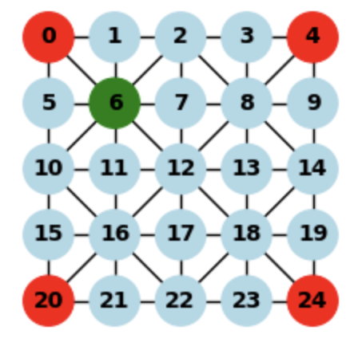

# Tiger and Goat Engine

## Overview
Tiger and Goat Engine is a toy project designed to develop a game engine for the traditional Nepali game [Tiger and Goat (Bagh-Chal)](https://en.wikipedia.org/wiki/Bagh-chal).

## Features
- **Game Engine for Bagh-Chal**: Implements the rules and mechanics of the traditional game.
- **Gymnasium Integration**: Use [Gymnasium](https://gymnasium.farama.org/index.html) to provide the environment for the RL.
- **Reinforcement Learning**: Use Deep-Q networks to learn a policy for playing Tiger and Goat.

## Conventions / Modelling

### Board
*Board Size:* The board is a 5x5 grid.

*Adjacency Matrix:* A 25x25 adjacency matrix represents the possible moves between positions on the board.

### Positions

*Positions:* Convention to identify all positions on the board. Position (0, 0) -> 0, (4, 4) -> 24.

### Moves
*Move Index:* For the action vector, we consider all possible moves. Elements 0-24 identify a goat placement on the respective position. Elements 25-649 capture moves (not placements) following *start_pos * 25 + end_pos + 25*